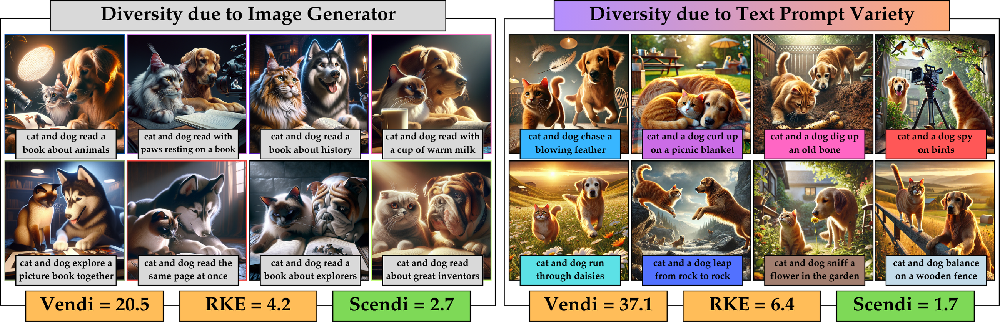

# Scendi Score for Prompt-Aware Diversity Evaluation

<hr>
<div align="center" style="line-height: 1;">
  <a href="https://aziksh-ospanov.github.io/Scendi/" target="_blank" style="margin: 2px;">
    
  </a>
  <a href="https://huggingface.co/datasets/aziksh/animals_with_objects_sdxl" target="_blank" style="margin: 2px;">
    
  </a>
  <a href="https://huggingface.co/datasets/aziksh/animals_with_fruits_dalle3" target="_blank" style="margin: 2px;">
    
  </a>
</div>

<p align="center">
  <a href="#1-installation">Installation</a> |
  <a href="#2-initialize-scendi">Initializing Scendi Score</a> |
  <a href="#3-compute-scendi">Computing Scendi Score</a> |
  <a href="#4-cluster-scendi">Clustering with Scendi</a> |
  <a href="#5-datasets">Datasets used</a> |
</p>


A GitHub repository accompanying a "Scendi Score: Prompt-Aware Diversity Evaluation via Schur Complement of CLIP Embeddings" paper



## 1. Installation
1. Clone the repository
```sh
git clone https://github.com/aziksh-ospanov/scendi-score.git
cd scendi-score
```
2. Install dependencies
```sh
pip install -r requirements.txt
```

## 2. Initializing Scendi Score
To compute Scendi score presented in the paper, initialize Scendi with the following:
```python
from scendi.score import ScendiEvaluator
from scendi.datasets.ImageFilesDataset import ImageFilesDataset

#%%
sigma = 3.5 # Gaussian kernel bandwidth parameter
fe = 'clip' # Embedding that supports both text and image modalities 

result_name = 'your_result_name'

img_pth = 'path_to_images'
text_pth = 'path_to_text.txt'

with open(text_pth, 'r') as f:
    prompts = f.readlines()
image_dataset = ImageFilesDataset(img_pth, name=result_name, extension='png')

scendi = ScendiEvaluator(logger_path='./logs', batchsize=64, sigma=sigma, num_samples=num_samples, result_name=result_name, rff_dim=2500, save_visuals_path=f'visuals_{result_name}')

scendi.set_schur_feature_extractor(fe, save_path='./save')  
```
In this snippet, parameter _sigma_ controls the bandwidth of the Gaussian Kernel and _fe_ allows to choose a specific feature extractor. In this repository we provide an implementation for CLIP, but other feature extractors may be used. We note that to access T2I and I2T evaluations, the feature extractor should support encoding of both text and image domains. 

## 3. Computing Scendi Score
To calculate the Scendi Score for a paired text-image dataset, use the following function:
```python
# Get Scendi Scores
score = scendi.scendi_score(prompts, image_dataset)
```

## 4. Clustering with Scendi

The script enables clustering of images after applying Scendi CLIP embedding correction based on prompts. Use the following function:
```python
# Cluster Results
scendi.scendi_clustering_of_dataset(prompts, image_dataset)
```
Note that top images, number of modes and sensitivity (_sigma_ parameter) are adjustable. The results are stored in location specified in _save_visuals_path_.

## 5. Datasets used
We provide access to datasets as follows:
- [Sharepoint Link](https://mycuhk-my.sharepoint.com/:f:/g/personal/1155133928_link_cuhk_edu_hk/EqRyXvuRjURIltCtoVK1T7kBWvKXasvbhxOyg7qCFZwQgg?e=L751H5)
- [SDXL generated animals with objects](https://huggingface.co/datasets/aziksh/animals_with_objects_sdxl)
- [DALL-E 3 generated animals eating fruits](https://huggingface.co/datasets/aziksh/animals_with_fruits_dalle3)


This `README.md` file provides a clear and concise guide for users to understand and run the demo script, including installation instructions, usage examples, and parameter explanations. Adjust the paths and filenames in the script to match your specific environment and dataset.


